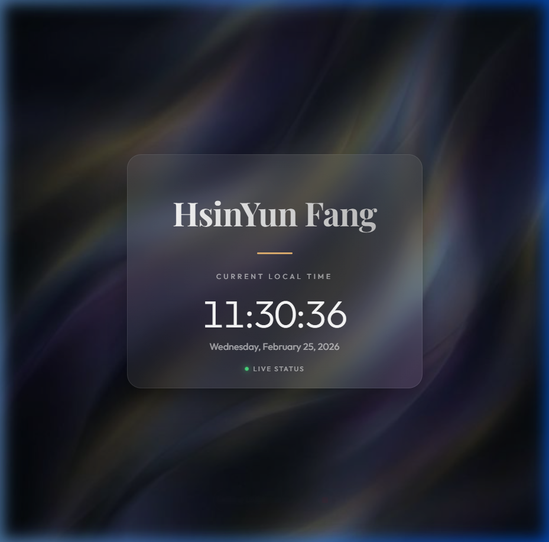

# Project Summary: Personal Single-Page Website
**Date:** February 25, 2026
**User:** HsinYun Fang

## 🚀 Overview
Today, I designed, developed, and deployed a premium personal single-page website for **HsinYun Fang**. The project emphasizes a modern "glassmorphism" aesthetic with real-time interactive elements.

**Demo:** [https://hsinyun-f.github.io/0225DRL_DIC1/](https://hsinyun-f.github.io/0225DRL_DIC1/)

## 🛠️ Actions Taken

### 1. Visual Design & Asset Generation
- **Custom Background**: Generated a high-definition, premium abstract background with iridescent gradients and fluid shapes to provide a sophisticated dark-themed look.
- **Image Integration**: Processed and integrated the generated image as `bg.png`.

### 2. Frontend Development
- **HTML5 Foundation**: Created `index.html` using semantic HTML, SEO meta tags, and premium typography from Google Fonts (Outfit & Playfair Display).
- **Glassmorphism CSS**: Developed `style.css` with:
    - Frosted-glass card effects.
    - Dynamic scale-and-blur background animations.
    - Responsive layouts for mobile and desktop.
    - Glowing state indicators for "live" status.
- **Interactive Logic**: Authored `script.js` which includes:
    - A **Real-Time Clock** that updates every second.
    - A **3D Tilt Effect** that allows the center card to react to mouse movement.

### 3. Quality Assurance
- **Verification**: Executed a browser subagent to confirm:
    - The name "HsinYun Fang" is correctly displayed.
    - The clock is live and accurate.
    - The visual design meets "premium" standards.
- **Visual Capture**: Took a high-quality screenshot of the final product for documentation.

### 4. Deployment & Version Control
- **Git Initialization**: Set up a local repository and configured user credentials (`hsinyun-f`).
- **Commits**: Captured the initial project state with all assets.
- **GitHub Push**: Successfully pushed the entire codebase to the remote repository: [0225DRL_DIC1](https://github.com/hsinyun-f/0225DRL_DIC1.git).
- **Live Demo**: [https://hsinyun-f.github.io/0225DRL_DIC1/](https://hsinyun-f.github.io/0225DRL_DIC1/)

## 📂 Deliverables
- `index.html`: Core structure.
- `style.css`: Visual styling.
- `script.js`: Interactive behavior.
- `bg.png`: Generated background asset.
- `homepage.png`: Screenshot of the resulting homepage.
- `summary.md`: This project summary.

## 🖼️ Resulting Homepage

